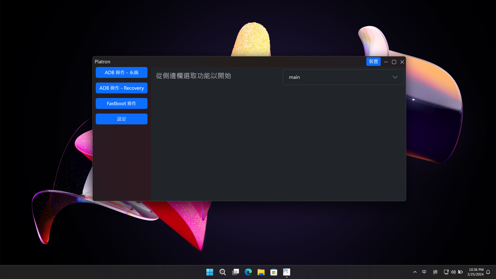
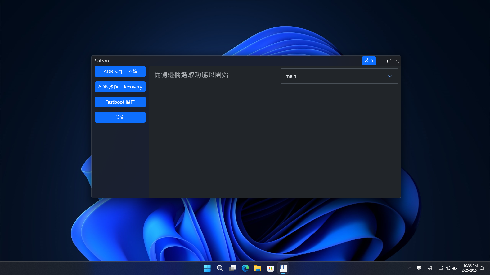
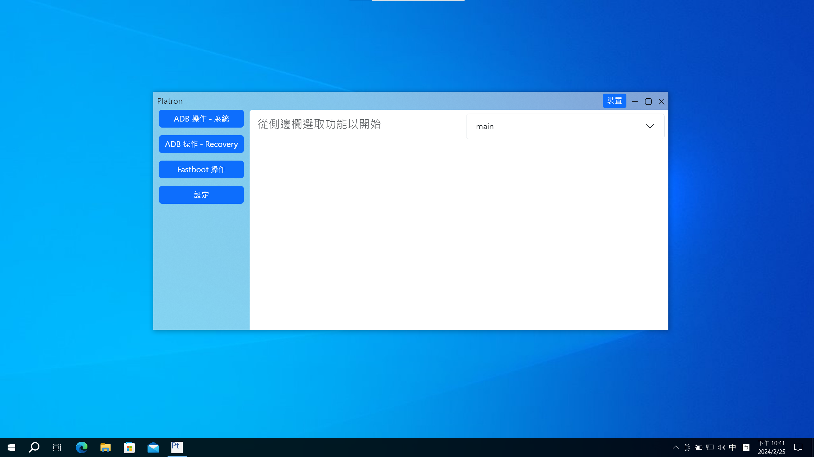
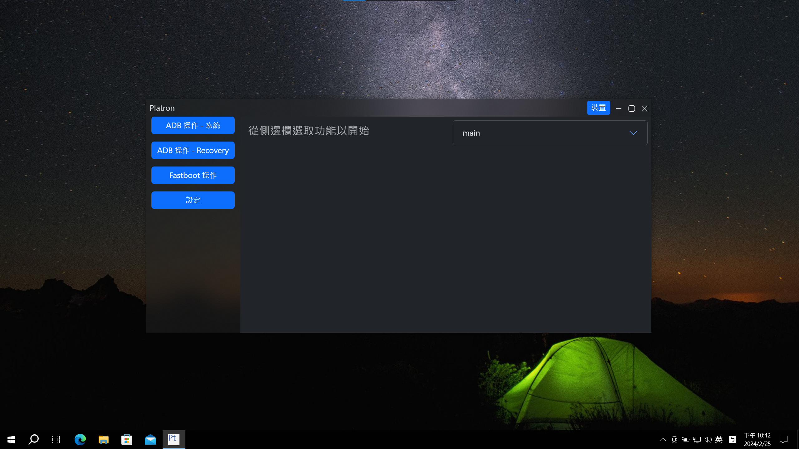

<p align="center">

<h1>Platron</h1>
</p>

## What is Platron

Platron is a graphical manager of ADB (Android Debug Bridge) and fastboot.

## Features of Platron

- Commonly used ADB and fastboot commands
- Power management (reboot to system, recovery, bootloader ,etc.)
- Flash/erase partition
- Run fastboot flashing/oem commands
- Get fastboot stored variables
- Switch between A/B slots
- Flash zips using PC
- You can now opreate multiple devices at the same time, imagine that rooting 10 phones with one click!

## Screenshot(s)

|  |  |
| --------------------------------------- | --------------------------------------- |
|  |  |

## Supported platforms

Linux and Windows are officially supported, ~~for macOS users, you can build it by yourself.~~

## Install & Update

### Install

Download release files from [Releases](https://github.com/platron-pt/platron/releases) page, or from our [Website](https://platron-pt.github.io/)

#### Windows

Please double click the exec file to install.

#### Linux

Extract the tar.xz, and excute `platron` which should be contained the output folder.

### Update

#### Windows

Updates will be checked every few days, you can set it in the settings page, or you can check it manually.

#### Linux

Currently not supported, download manually from the links above.

## Building from source (For both platforms)

1. Clone this repository
1. Install Node.js (LTS) and npm
1. Install dependencies

   ```console
   $ npm ci
   ```

1. Download platform-tools

   ```console
   $ node scripts/platronMaker.js -d #Auto detect whether Windows or Linux, for macOS users, please download it manually.
   ```

1. Configure Platron
   ```console
   $ node scripts/platronMaker.js -v=<variant> #beta and stable are suggested, or you can modify the source code
   ```
1. Build Platron
   ```console
   $ node scripts/platronMaker.js -b -w=<development|production> -p=<never|always>
   ```
   `-w` argument for webpack mode.\
   `-p` argument for electron-builder to publish (to supported platform) or not.
