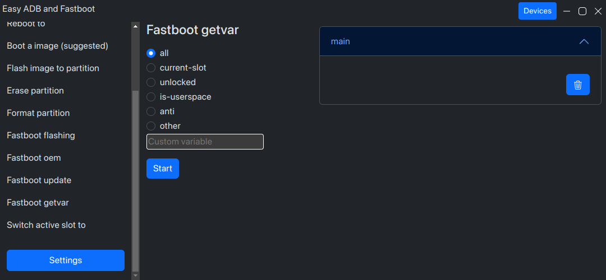
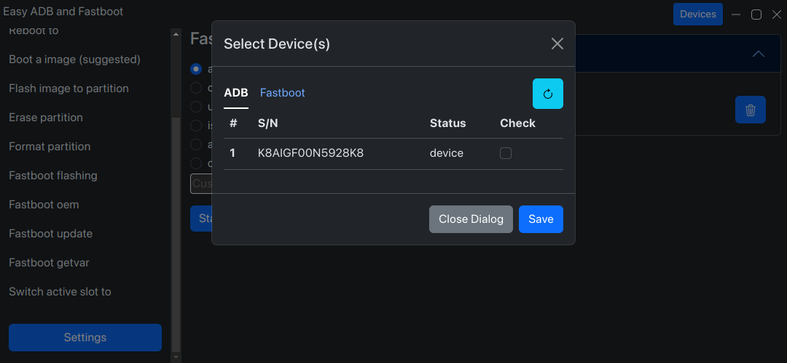
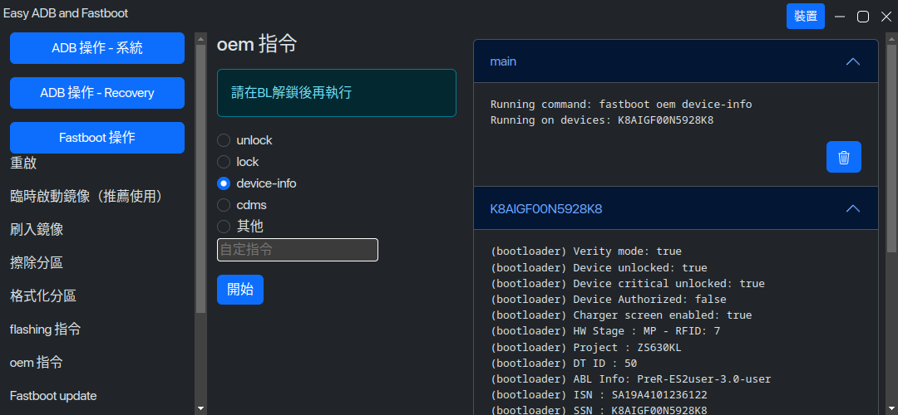

# Platron

## Platron 是什麼

Platron 是一個圖形化的 ADB 和 fastboot 管理器

## Platron 的功能

- 常用的 adb 和 fastboot 指令
- 電源管理，包括重啓到系統、recovery 或 fastboot 模式
- 刷入和擦除分區
- fastboot oem 和 fastboot flashing 指令
- 取得 fastboot 中儲存的變數
- 切換 AB 槽
- 使用電腦安裝可刷入的 zip
- 現在支援多裝置，一鍵 root 10 台手機不再是夢～

## 截圖





## 支援的平台

目前官方發佈 Linux 和 Windows 版，~~macOS 用戶請自行編譯~~

## 安裝與更新

### 安裝

從 [Releases](https://github.com/platron-pt/platron/releases) 頁面下載, 或從我們的 [網站](https://platron-pt.github.io/)

#### Windows

雙擊 exe 檔案安裝

#### Linux

解壓縮下載到的 tar.xz, 並執行 `platron`

### 更新

#### Windows

每隔數天將自動檢查更新，可以在設定中變更，或手動檢查更新

#### Linux

目前不支援，請自行下載新版

## 從原始碼構建

1. 克隆原始碼
1. 安裝 Node.js (LTS) 和 npm
1. 安裝依賴

   ```console
   $ npm ci
   ```

1. 下載 platform-tools

   ```console
   $ node scripts/platronMaker.js -d #自動偵測 Windows 或 Linux，macOS 請自行下載
   ```

1. 配置
   ```console
   $ node scripts/platronMaker.js -v=<variant> #建議填入beta 或 stable ，其他設定請自行修改原始碼
   ```
1. 建置 Platron
   ```console
   $ node scripts/platronM